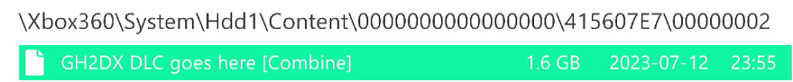

## *Guitar Hero II Deluxe 360* is a Massive Quality-of-Life Overhaul Mod for Xbox 360

### With features like an FC and streak indicator, custom track and menu themes, an increased song limit, and no strum limit, *Guitar Hero II Deluxe 360* makes the experience as definitive as possible!

### 👉 See [Full Feature List](https://github.com/hmxmilohax/Guitar-Hero-II-Deluxe-360/blob/main/dependencies/features.md#features)

### 📥 [Download Now!](Guitar-Hero-II-Deluxe-360/#%EF%B8%8F-Downloads)

 

 

# 📥 Downloads

*Guitar Hero II Deluxe recieves very frequent updates. You can click the `Watch` button (All Activity) to be notified about any updates that occur.*

### 📥 [Guitar Hero II Deluxe 360 (Standard)](https://nightly.link/hmxmilohax/Guitar-Hero-II-Deluxe-360/workflows/build/main/GH2DX-Xbox.zip)

> The standard install, typical for most users.

📥 [GH2DX360 (Series X/S Xenia)](https://nightly.link/hmxmilohax/rock-band-3-deluxe/workflows/build/main/RB3DX-Xbox-Base-Force-Guitar-Controller.zip)

> Forces all instruments to be Guitar controllers since Xenia UWP does not support them at the moment.

 

# 📩 How to Install

## 📩 Installing on Xbox 360

**NOTE: You WILL need a HACKED/MODDED (RGH or JTAG) Xbox 360 in order to play this mod on console. We hope this is clear.**

* Download [Guitar Hero II Deluxe 360 (Standard)](https://nightly.link/hmxmilohax/Guitar-Hero-II-Deluxe-360/workflows/build/main/GH2DX-Xbox.zip)
  * **Copy the contents of it to an empty folder** (we recommend using FTP to do so).

  If using Aurora, you can also grab customized box art directly from your internet connected RGH console.

* Scan/Find Guitar Hero II Deluxe in your Aurora games list

* Select `Details`

* Select `Preview`

* Scroll left until `Download cover` is shown

* Select `Download cover`

* `Cover #25456` and `Cover #25581` are Guitar Hero II Deluxe Covers

### ✅ ***Guitar Hero II Deluxe 360 is now installed!***

 

## 📩 Installing on Xbox Series X/S ([Xenia UWP](https://github.com/SirMangler/xenia/releases))

**NOTE: You WILL need an Xbox Series X/S running in [Developer Mode](https://learn.microsoft.com/en-us/windows/uwp/xbox-apps/devkit-activation). We hope this is clear.**

* **Extract and copy your copy of Guitar Hero II Deluxe 360** to your USB drive.

* Download Guitar Hero II Deluxe 360. Xenia UWP currently does not have guitar support so you need to download the `Series X/S Xenia` versions.
  * Copy the contents of it and paste Guitar Hero II Deluxe 360 to your USB drive.

  ### ✅ ***Guitar Hero II Deluxe 360 is now installed!***

 

## 📩 Installing on Xenia (Advanced)

*Follow [**Building (Advanced)**](#-building-advanced) first in order to properly follow this guide.*

* Then, **navigate to `windows_bats`** if you're on Windows or **`user_scripts`** if you're on Linux and **run `build_xenia` to automatically update, build, and run Guitar Hero II Deluxe 360*.**
  * *You need to run this script every time in order to play and update the game. `run_xenia` will run the game only and won't update and build it unless a new update is available, so you can use that if `build_xenia` takes too long.*

* If your controller does not respond, navigate to the `_xenia` folder and **map your controller with x360ce**.
  * When it asks you to create `xinput1_3.dll`, create it and **rename it to `xinput1_4.dll`**.
  * If your controller is mapped and recognized and still doesn't register any inputs, unplug it from your PC and plug it back in while Xenia is still open.
    
    ### ✅ ***Guitar Hero II Deluxe 360 is now installed!***

 

## 🎵 Additional Songs

You can find song packs compatible with Guitar Hero II Deluxe 360 on [**This Spreadsheet**](https://docs.google.com/spreadsheets/d/1-3lo2ASxM-3yVr_JH14F7-Lc1v2_FcS5Rv_yDCANEmk/edit#gid=159080071).

You can also find the song packs for the original games here:

* [GH1DX](https://nightly.link/hmxmilohax/gh1dx-songs/workflows/build/main)

* [GHIIDX](https://nightly.link/hmxmilohax/gh2dx-songs/workflows/build/main)

* [GH80SDX](https://nightly.link/hmxmilohax/gh80sdx-songs/workflows/build/main)

* [GHIIDXDLC](https://nightly.link/hmxmilohax/gh2dxdlc-songs/workflows/build/main) 

You can also use [**Onyx Music Game Toolkit**](https://github.com/mtolly/onyxite-customs) to generate your own custom song packs for Guitar Hero II Deluxe 360, and vice versa. Converting custom songs from games like Clone Hero is a breeze.

### 🎵 Installing Songs on Xbox 360

* Download an Xbox 360 song pack of your choice.
* Copy it to its respective folder.

***Note: Only 16 packs can be installed at one time***

### 🎵 Installing Songs on Xenia (Desktop and UWP)

* Download an Xbox 360 song pack of your choice.
* Open Xenia, navigate to `File > Install Content`, and select your song pack(s) of choice. You can select more than one at a time.

***Note: Only 16 packs can be installed at one time***

* If you're on Xbox Series X/S, copy the entire `content` folder to your USB drive.
  * Click `Yes` to overwrite the files if it asks you to.

 

## 🎨 Custom Highways
Guitar Hero II Deluxe 360 supports the import of custom highways via the use of an all in one bat file.

*Follow [**Building (Advanced)**](#-building-advanced) first in order to properly follow this guide.*

* Copy any `.jpg`, `.png`, or `.bmp` file into `\highways\`, then and run `highways.bat`.
  * These will make them show up in game, resize your images accordingly (including those with arbitrary resolutions), and convert them to the proper format for *Guitar Hero II Deluxe 360* to read.

***You will need to rebuild Guitar Hero II Deluxe 360 in order for these to take effect.***

## 🎨 Custom Theme Textures

By default, *Guitar Hero II Deluxe 360* contains a variety of custom textures, found in the `Overshell` in-game, as well as a way to import your own with relative ease.

### Importing Your Own Textures

*Follow [**Building (Advanced)**](#-building-advanced) first in order to properly follow this guide.*

* Copy any `.jpg`, `.png`, or `.bmp` file into `\custom_track_textures\`, then and run `textures-custom_track_textures.bat`.
  * These will make them show up in game, resize your images accordingly (including those with arbitrary resolutions), and convert them to the proper format for *Guitar Hero II Deluxe 360* to read.

***You will need to rebuild Guitar Hero II Deluxe 360 in order for these to take effect.***

 

## 📝 Setting Custom Default Settings

Custom default settings, such as always setting your preferred track speed, are not saved automatically by Guitar Hero II Deluxe.
You will have to manually edit a file or two and rebuild the game to save your Custom settings.

*Follow [**Building (Advanced)**](#-building-advanced) first in order to properly follow this guide.*

* Navigate to `_init`
    * Open chosen `.dta` file in a text editor

Each `.dta` file handles different things

`init.dta`
> Handles modifers

`init_track_theme.dta`
> Handles color information for the main guitar scene

`init_ui_theme.dta`
> Handles various information about the menus

`init_track_theme_template.dta` and `init_ui_theme_template.dta`
> Backups of the original themes

After you have made your edits run `_init-dta2b.bat` and if needed copy the files from _build/Xbox/gen to /gen on your install.

 

# 🔨 Building (Advanced)

### Installing Python (Required)

* Head to the [**Python downloads**](https://www.python.org/downloads/), download and install Python (version 3.9 or later).
  * ***Select "Add python.exe to PATH"*** on the installer.

### Initializing the Repo

* Go to the **[Releases](https://github.com/hmxmilohax/Guitar-Hero-II-Deluxe-360/releases)** of this repo and **download `_init_repo.py`**.
  * Make a new **empty** folder, **put `_init_repo.py` in the folder, and run it**. This will pull the repo down for you and make sure you're completely up to date. **This will take some time.**

### ***The folder should look like this once it's done:***

### ✅ ***The Guitar Hero II Deluxe 360* repo is now set up!***

From here, you can make any personal modifications to the game or build it yourself.

* Navigate to `windows_bats` if you're on Windows or `user_scripts` if you're on Linux.
  * Run the `build_` script for your platform of choice to build *Guitar Hero II Deluxe 360**.
  * Built contents will be in the `_build` folder on the root of the repo.

You can now return to [**Installing on Xenia (Advanced)**](#-installing-on-xenia-advanced) or [**Custom Textures**](#-custom-textures).

 

# 🖥️ Dependencies

[Git for Windows](https://gitforwindows.org/) - CLI application to allow auto updating gh2 repo files

[Dot Net 6.0 Runtime](https://dotnet.microsoft.com/en-us/download/dotnet/6.0/runtime) - Needed to run ArkHelper

[x360ce 3.2](https://www.x360ce.com/) - Specific build to emulate a Xinput device

[Mackiloha](https://github.com/PikminGuts92/Mackiloha) - ArkHelper for building GH2 ARK - Superfreq for building .bmp_xbox highway images

[dtab](https://github.com/mtolly/dtab) - For serializing GH2 dtb files

[Xenia 930fe2c_canary_experimental](https://github.com/xenia-canary/xenia-canary/releases/tag/930fe2c) - Xbox 360 emulator specific build with a config option that fixes GH2 audio sync

[ImageMagick](https://imagemagick.org/script/download.php) - For converting highways to standard sizes