

## *Guitar Hero II Deluxe 360* is a Massive Quality-of-Life Overhaul Mod for Xbox 360

### With features like an FC and streak indicator, custom track and menu themes, an increased song limit, and no strum limit, *Guitar Hero II Deluxe 360* makes the experience as definitive as possible!

### 👉 See [Full Feature List](https://github.com/hmxmilohax/Guitar-Hero-II-Deluxe-360/blob/main/dependencies/features.md#features)

### 📥 [Download Now!](Guitar-Hero-II-Deluxe-360/#%EF%B8%8F-Downloads)

 

 

# 📥 Downloads

*Guitar Hero II Deluxe recieves very frequent updates. You can click the `Watch` button (All Activity) to be notified about any updates that occur.*

### 📥 [Guitar Hero II Deluxe 360 (Standard)](https://nightly.link/hmxmilohax/Guitar-Hero-II-Deluxe-360/workflows/build/main/GH2DX-Xbox.zip)

> The standard install, typical for most users.

📥 [GH2DX360 (Series X/S Xenia)](https://nightly.link/hmxmilohax/rock-band-3-deluxe/workflows/build/main/RB3DX-Xbox-Base-Force-Guitar-Controller.zip)

> Forces all instruments to be Guitar controllers since Xenia UWP does not support them at the moment.

 

# 📩 How to Install

## 📩 Installing on Xbox 360

**NOTE: You WILL need a HACKED/MODDED (RGH or JTAG) Xbox 360 in order to play this mod on console. We hope this is clear.**

* Download [Guitar Hero II Deluxe 360 (Standard)](https://nightly.link/hmxmilohax/Guitar-Hero-II-Deluxe-360/workflows/build/main/GH2DX-Xbox.zip)
  * **Copy the contents of it to an empty folder** (we recommend using FTP to do so).

### ✅ ***Guitar Hero II Deluxe 360 is now installed!***

## 📩 Installing on Xbox Series X/S ([Xenia UWP](https://github.com/SirMangler/xenia/releases))

**NOTE: You WILL need an Xbox Series X/S running in [Developer Mode](https://learn.microsoft.com/en-us/windows/uwp/xbox-apps/devkit-activation). We hope this is clear.**

* **Extract and copy your copy of Guitar Hero II Deluxe 360** to your USB drive.

* Download Guitar Hero II Deluxe 360. Xenia UWP currently does not have guitar support so you need to download the `Series X/S Xenia` versions.
  * Copy the contents of it and paste Guitar Hero II Deluxe 360 to your USB drive.

  ### ✅ ***Guitar Hero II Deluxe 360 is now installed!***

  ## 📩 Installing on Xenia (Advanced)

*Follow [**Building (Advanced)**](#-building-advanced) first in order to properly follow this guide.*

* Then, **navigate to `windows_bats`** if you're on Windows or **`user_scripts`** if you're on Linux and **run `build_xenia` to automatically update, build, and run Rock Band 3 Deluxe.**
  * *You need to run this script every time in order to play and update the game. `run_xenia` will run the game only and won't update and build it unless a new update is available, so you can use that if `build_xenia` takes too long.*

* If your controller does not respond, navigate to the `_xenia` folder and **map your controller with x360ce**.
  * When it asks you to create `xinput1_3.dll`, create it and **rename it to `xinput1_4.dll`**.
  * If your controller is mapped and recognized and still doesn't register any inputs, unplug it from your PC and plug it back in while Xenia is still open.
    
    ### ✅ ***Guitar Hero II Deluxe 360 is now installed!***

## 🎵 Additional Songs

You can find song packs compatible with Guitar Hero II Deluxe 360 on [**This Spreadsheet**](https://docs.google.com/spreadsheets/d/1-3lo2ASxM-3yVr_JH14F7-Lc1v2_FcS5Rv_yDCANEmk/edit#gid=159080071).

You can also find the song packs for the original games here:

* [GH1DX](https://nightly.link/hmxmilohax/gh1dx-songs/workflows/build/main)

* [GHIIDX](https://nightly.link/hmxmilohax/gh2dx-songs/workflows/build/main)

* [GH80SDX](https://nightly.link/hmxmilohax/gh80sdx-songs/workflows/build/main)

* [GHIIDXDLC](https://nightly.link/hmxmilohax/gh2dxdlc-songs/workflows/build/main) 

You can also use [**Onyx Music Game Toolkit**](https://github.com/mtolly/onyxite-customs) to generate your own custom song packs for Guitar Hero II Deluxe 360, and vice versa. Converting custom songs from games like Clone Hero is a breeze.

### 🎵 Installing Songs on Xbox 360

* Download an Xbox 360 song pack of your choice.
* Copy it to its respective folder.

***Note: Only 16 packs can be installed at one time***

### 🎵 Installing Songs on Xenia (Desktop and UWP)

* Download an Xbox 360 song pack of your choice.
* Open Xenia, navigate to `File > Install Content`, and select your song pack(s) of choice. You can select more than one at a time.

***Note: Only 16 packs can be installed at one time***

* If you're on Xbox Series X/S, copy the entire `content` folder to your USB drive.
  * Click `Yes` to overwrite the files if it asks you to.

## 🎨 Custom Textures

By default, *Guitar Hero II Deluxe 360* contains a variety of custom textures, found in the `Deluxe Settings` menu in-game, as well as a way to import your own with relative ease.

### Importing Your Own Textures

*Follow [**Building (Advanced)**](#-building-advanced) first in order to properly follow this guide.*

* Copy any `.jpg`, `.png`, or `.bmp` file into `\custom_textures\***\`, then navigate back to `windows_bats` and run `process_textures_***.bat`.
  * These will make them show up in game, resize your images accordingly (including those with arbitrary resolutions), and convert them to the proper format for *Guitar Hero II Deluxe 360* to read.

***You will need to rebuild Guitar Hero II Deluxe 360 in order for these to take effect.***

 

## 📝 Setting Custom Default Settings

Custom default settings, such as always setting your preferred track speed, are not saved automatically by Guitar Hero II Deluxe.
You will have to manually edit a file or two and rebuild the game to save your Custom settings.

*Follow [**Building (Advanced)**](#-building-advanced) first in order to properly follow this guide.*

* Navigate to `_init`
    * Open chosen `.dta` file in a text editor

Each `.dta` file handles different things

`init.dta`
> Handles modifers

`init_track_theme.dta`
> Handles color information for the main guitar scene

`init_ui_theme.dta`
> Handles various information about the menus

`init_track_theme_template.dta` and `init_ui_theme_template.dta`
> Backups of the original themes

After you have made your edits run `_init-dta2b.bat` and if needed copy the files from _build/Xbox/gen to /gen on your install.

# 🔨 Building (Advanced)

### Installing Python (Required)

* Head to the [**Python downloads**](https://www.python.org/downloads/), download and install Python (version 3.9 or later).
  * ***Select "Add python.exe to PATH"*** on the installer.

### Initializing the Repo

* Go to the **[Releases](https://github.com/hmxmilohax/Guitar-Hero-II-Deluxe-360/releases)** of this repo and **download `_init_repo.py`**.
  * Make a new **empty** folder, **put `_init_repo.py` in the folder, and run it**. This will pull the repo down for you and make sure you're completely up to date. **This will take some time.**

### ***The folder should look like this once it's done:***

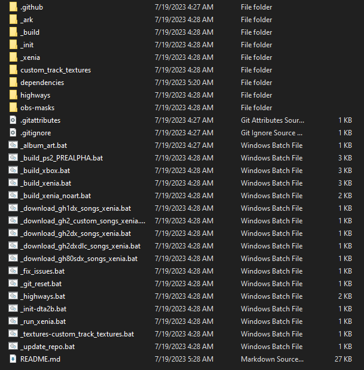

### ✅ ***The Rock Band 3 Deluxe repo is now set up!***

From here, you can make any personal modifications to the game or build it yourself.

* Navigate to `windows_bats` if you're on Windows or `user_scripts` if you're on Linux.
  * Run the `build_` script for your platform of choice to build *Rock Band 3 Deluxe*.
  * Built contents will be in the `_build` folder on the root of the repo.

You can now return to [**Installing on Xenia (Advanced)**](#-installing-on-xenia-advanced) or [**Custom Textures**](#-custom-textures).

 

# 🖥️ Dependencies

[Git for Windows](https://gitforwindows.org/) - CLI application to allow auto updating gh2 repo files

[Dot Net 6.0 Runtime](https://dotnet.microsoft.com/en-us/download/dotnet/6.0/runtime) - Needed to run ArkHelper

[x360ce 3.2](https://www.x360ce.com/) - Specific build to emulate a Xinput device

[Mackiloha](https://github.com/PikminGuts92/Mackiloha) - ArkHelper for building GH2 ARK - Superfreq for building .bmp_xbox highway images

[dtab](https://github.com/mtolly/dtab) - For serializing GH2 dtb files

[Xenia 930fe2c_canary_experimental](https://github.com/xenia-canary/xenia-canary/releases/tag/930fe2c) - Xbox 360 emulator specific build with a config option that fixes GH2 audio sync

[ImageMagick](https://imagemagick.org/script/download.php) - For converting highways to standard sizes

## Introduction

This Repo contains everything you need to build an ark for Guitar Hero II Deluxe 360, and can also run the included xex on Windows with an included build of Xenia.

Xenia is pre-setup for portable installation, with its own config file that sets a specific option that negates the default latency issues (max_queued_frames = 3).

To run Guitar Hero II Deluxe with an uncapped framerate, set `vsync = false` in `xenia-canary.config.toml`.

Unlock all is enabled by default, and the goal of this specific version of gh2 is to strip out as much fluff as possible. The ui philosophy is deliberately taking cues from [Clone Hero](https://clonehero.net/).

A specific build of [x360ce 3.2](https://www.x360ce.com/) that supports guitar mappings is also included if you need it.

# Features

* No strum limit executable.

* In game readouts tracking FC, Note Streak, Overstrums, Missed Notes, Song Progress, Stars, Star Progress.

* Drums support including beta drum gems.

* "Overshell" - a custom on screen menu system for changing modifiers/speeds/themes/colors/characters/venues etc. Opened by pressing `Select Select` on most menu screens. You may just want to get in the habit of spamming select.

* User generated, sharable, ini-like config files to customize the look and feel of the ui, and in game track.

* An increasing selection of modifiers allowing tuning of how you want to play. These modifiers can also be setup as defaults.

* Randomized (or forced) Characters, Venues, and Guitars per song.

* Overhauled menus with additional features.

* Unlimited setlist scrolling. **Saving will be disabled after 241 (250 total) songs are loaded.**

* Modern Star calculation.

* Feature complete on both Xbox 360 Hardware and Xenia Emulator.

* No overscan by default (requires separate XEX)

* PS2 port in the works (currently unplayable).

# Modifiers

* Focus Mode - Blacks out the in-game Venue to focus on gameplay. Upon enabling, the intro/outro animations will be disabled, note streak popups will be disabled, and certain sound effects will be disabled.

* Whammy FX - Disables the pitch shift applied when using the whammy on sustains.

* Track Muting - Disables muting of the currently played instrument when notes are missed.

* No Flames - Removes flame animation on note hits.

* No Fail - Disables failing out of a song.

* Autoplay - Enables the Bot in game. Certain measures have been taken to discourage abuse.

* Tight Speedups - Keeps the default tightening of the engine that occurs when using in-engine speedups.

* Towel Hyperspeed - Mimicks old school Guitar Hero 1 gameplay of the same name, with no towel required. This will lock your track speed to 100%, and notes will be invisible until roughly the middle of the highway.

* Brutal Mode - A poor man's representation of the Rock Band 4 feature of the same name. Notes disappear as they travel down the track. However, the line in which they disappear does not move dynamically, and sustain notes do not disappear.

* Select to restart - Star Power is enabled in practice mode for SP pathing. This modifier will allow you to instead use the select button to reset the current section.

* Name Title - Displays the users given title below the fret smashers in game.

* Song Title Always - Always displays the song info display, this includes the Notes Missed and Overstrums readout.

* Clean MTV - Only displays song title, artist name, and if available, author on the song info display.

* Less Beat Lines - Removes quarter beat lines from the track for a more cleaner amount of beatlines.

* No Division Lines - removes the "strings" verticle lines between frets on the highway.

* Skip Intro - Skips the intro fly in animation when starting a song.

* Skip Outro - Skips the outro win animation when completing a song.

* Force Encore - Forces the current song to act as an encore, gives unique intro camera animation.

* Sound Effects - Disables certain sound effects such as the crowd in game.

* Note Streak Popups - Disables the note streak interval message popups in game.

* Star Power Popup - Disables the "Star Power Ready" message popups in game.

* Highway Shake - Disables the Highway shake on note miss and Star Power deployment. This is required for Clone Hero Hud/skinny highway.

* Monkey Head - The vanilla Monkey Crowd Head cheat.

* Eyeball Head - The vanilla Eyeball Crowd Head cheat.

* Flaming Head - The vanilla Flaming Head cheat.

* Performance Mode - The vanilla performance mode cheat. Combine with autoplay for venue captures.

* Neckless Mode - Removes only the highway in-game, leaving the score meter, crowd meter, and SP bar.

* Roxbury Mode - Hidden away in the vanilla files, this cheat rocks the track on beat in game. Named from the movie "A Night at the Roxbury", referencing the head bob characters in the movie perform.

# Track Modifiers

* Void Frets - Blacks out the inner portion of the fret smasher

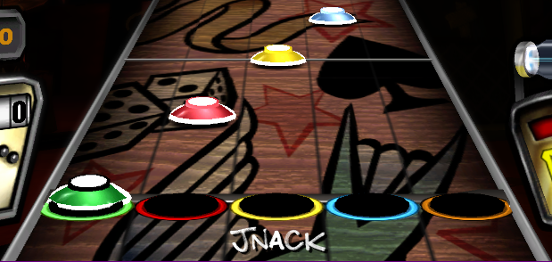

* Eyeball Gems - Tucked away in the vanilla files, this applies an eyeball texture to the gems.

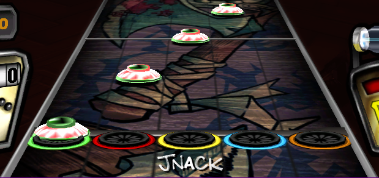

* Clone Hero Hud - Changes many aspects of the on screen track. Provides a Clone Hero/WoR Crowd meter, score meter, star power bar, and streak display.

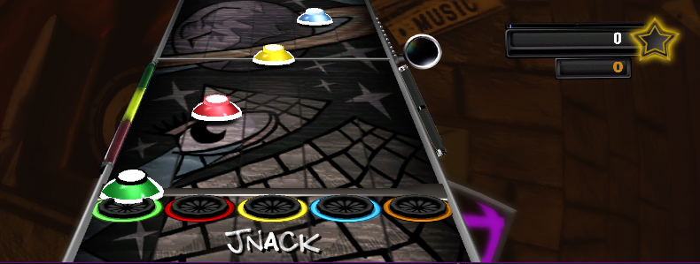

* Bright HOPOs - Applies a new texture to the hopo gems to fully white out the caps. Helps distinguish hopos from strums.

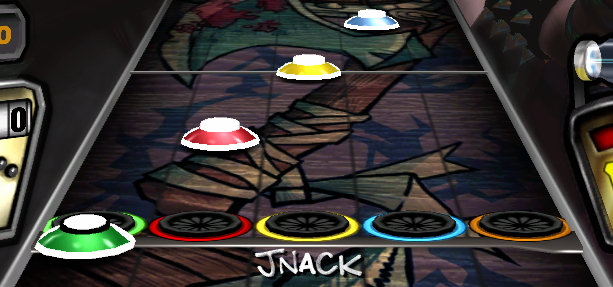

* Dark Strums - Applies a new texture to the strum gems to darken the white portions of the gems. Helps distinguish strums from hopos.

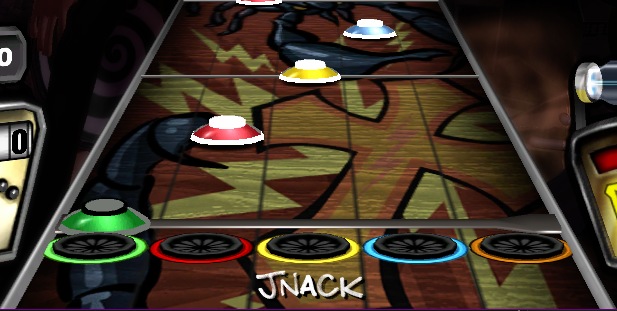

* GH1 Track - Port of the Guitar Hero 1 Gems and Smashers. These will produce a stutter on first load as shaders are being generated for the 3d models.

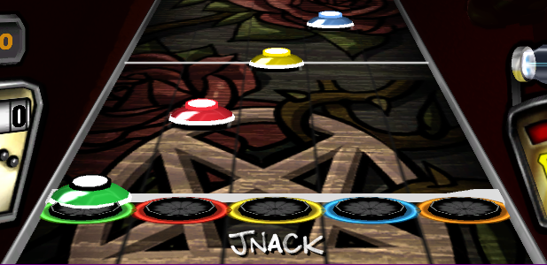

* GH3 Frets - Custom textured fret smashers ripped from Guitar Hero III.

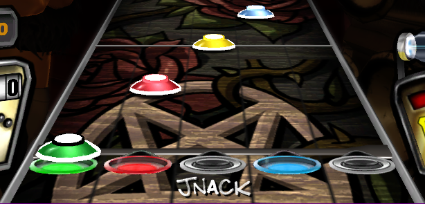

# In-Depth Features

## Overshell

Opened by pressing `Select Select` on most menu screens. Overshell is the primary way to customize all aspects of Guitar Hero II Deluxe from within the game. Overshell contains submenus and sometimes even helpful tips as you set new modifications. Some Overshell screens even graphically show you the current selection.

Difficulty - Opens the difficulty menu. This is also where you can set lefty flip.

Color Selector - Opens the color picker menu for various ui elements. Inside is a "Pick Element" button with a list of customizable ui elements. You cannot save these selections from in game for subsequent reboots.

Speed Settings - Opens a slider menu to choose Track Speed, Song Speed, Venue FPS, as well as a shortcut to turning on Focus Mode.

Modifiers - Opens the Modifiers sub-menu. This menu also contains the Select Highway, Select Font, and Track Modifiers sub-menus.

Venue Select - Menu to force a selected venue.

Character Select - Menu to force a selected character.

Guitar Select - Menu to force a selected guitar.

Theme Select - Menu to choose the current UI theme.

Audio Options - The vanilla Audio Options screen for volume adjustments.

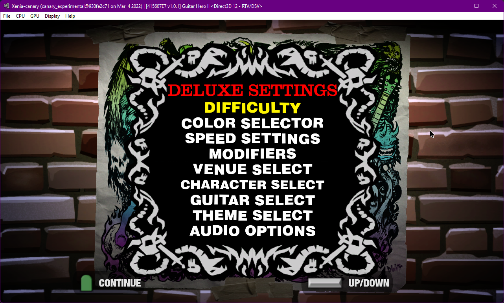

## Song Select

The Select Song screen has been re-worked to allow a theoretical infinite amount of songs to be scrolled through.

However, a big drawback is the save file is limited to a total of 250 songs saved before the save will no longer load. To combat this, saving is automatically disabled if the amount of songs loaded exceeds 250 songs.

Guitar Hero II Deluxe technically uses career mode for quickplay gameplay, as such, scores will be shown on the song select screen.

A random song button is also included on the song select screen to shuffle the library.

Additionally, detailed song information in the style of RB/CH is available for DX songs out of the box. As of writing, Onyx support to output this information for dx on new conversions, is currently in development. Some specific artists, namely Harmonix and Neversoft, have custom colors for their author name.

Potential detailed song information includes

* Artist
* Author
* Album
* Year
* Genre
* Origin
* Difficulty
* Length

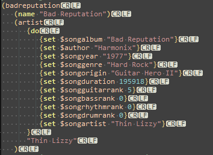

Previously converted tracks for gh2dx will not have this information unless manually applied.

Album art is also supported via a bmp_xbox (512x512) or bmp_ps2 (256x256) image file in the song folder, in a `gen` subfolder. The image should be named exactly the same as the shortname of the song. Ex:

* _xenia\content\415607E7\00000002\GHIIDX\songs\arterialblack\arterialblack.bmp_xbox

The build scripts will automatically detect album art in the `/Content/` directories for your song, and generate them where they need to go.

These images are read in game from outside of the ARK as raw files. An `album_art` folder will be generated in `_build/Xbox` that contains these images for you.

This image generation support is also planned to be coming in a future Onyx update.

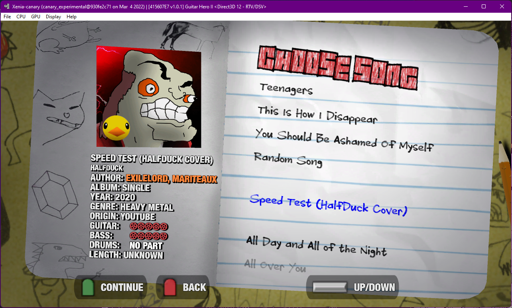

## Endgame Screen

The endgame screen has seen some layout changes to make room for some new upgrades.

Average Multiplier, SP Phrases, and Notes Hit are now found on this screen, rather than the section stats screen.

Stars now show a more detailed readout, tracking to the hundredths place.

Notes Hit Percentage now shows a more detailed readout, tracking to the hundredths place.

Various modifier status is reported on screen to give indication on how the player prefers to play.

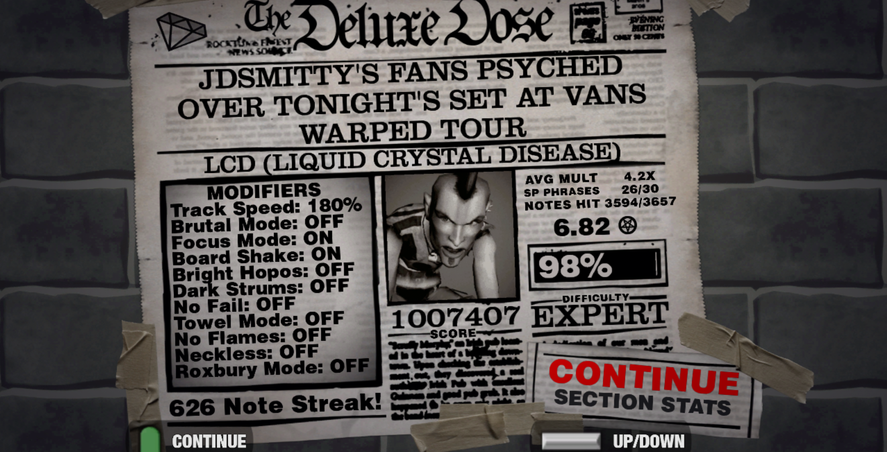

## Themes

Theming of a good chunk of UI and Track items is supported in Guitar Hero II Deluxe.

This can be accomplished by modifying `_theme/init_track_theme.dta` or `_theme/init_ui_theme.dta`.

Inside both of these scripts are a variety of options to choose from and change colors for your own personalized track theme or ui theme for the game.

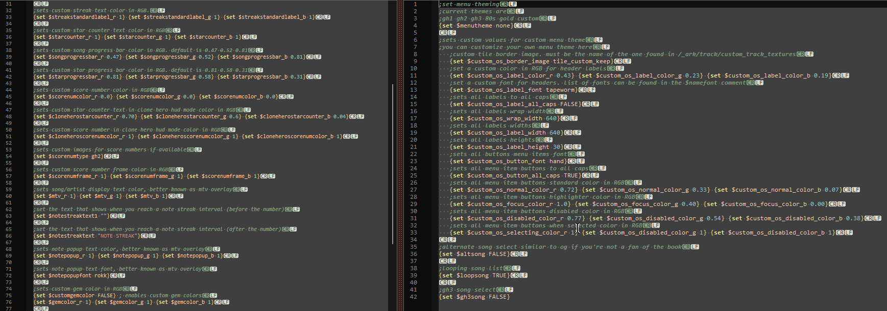

Once done editing the dta file to your liking, or installing one found from #gh2-theme-share channel in the Milohax discord, run `_theme-dta2b.bat` from the root of the repo.

Theme dta files can be shared and transferred between installations just like clone here ini's. Just run `_theme-dta2b.bat` after aquiring your theme dta.

Re-running Xenia will apply your changes, or, if on hardware, simply copy the two new `.dtb` files from the `_build/Xbox/gen` folder to the same location on your Xbox.

The different menu themes in Guitar Hero 2 Deluxe all utilize this theme system for their respective themes, so there is a great variety to choose from!

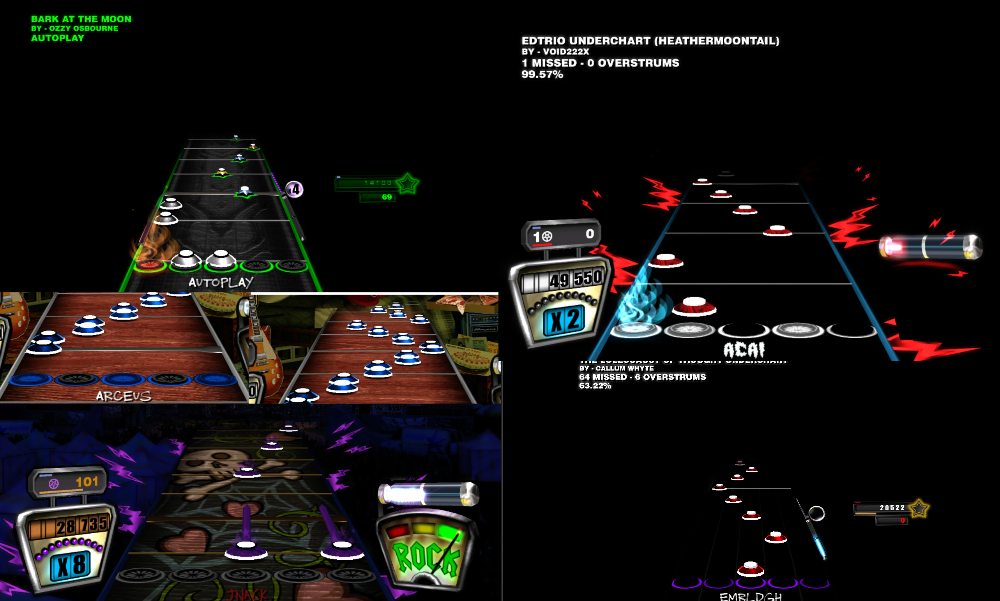

## Init/Setting Custom Defaults

Custom defaults, such as always setting your preferred track speed, are not saved automatically by Guitar Hero II Deluxe.

Instead, you will have to manually edit a file or two and rebuild the game to save your custom modifiers.

This has been setup to be as easy as possible.

Simply open `_ark/ui/init.dta` and start editing to your liking. Each modifier has an associated comment paired with it to detail it's functions. Theming options can be found above, reading the `Themes` section of this readme.

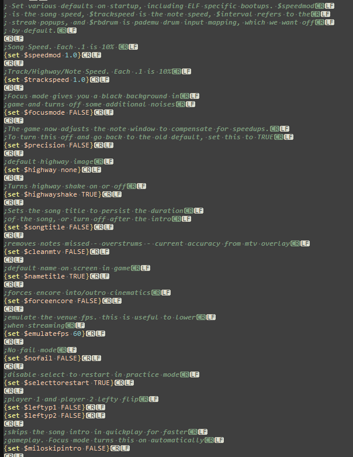

Once done, save the edited dta, and build the ark again. If playing on real hardware, you will have to transfer the entire ark to your Xbox again for the new saved settings.

Editing init.dta will cause conflicts down the road if the file is changed on the repo. if you are having trouble getting new features when building the arks, run `_reset.bat` to restore the repo to a clean state, and build again.

# Install

NOTE: You WILL need a modded/hacked console to play this mod on real hardware. I hope this is clear.

## Repo Setup
Setting up GHIIDX 360 for the first time is meant to be as easy as possible.
As well, it is designed to allow you to automatically receive updates as the repo is updated.

Simply go to the Releases of this repo and grab all three files. (two .exe, one .bat)

The two exe's are a couple dependencies, [Git for Windows](https://gitforwindows.org/), and [Dot Net 6.0 Runtime](https://dotnet.microsoft.com/en-us/download/dotnet/6.0/runtime).
Git is required for you to take advantage of auto updating via github pulls. Dot Net is required to build an ARK file, the archive format the game needs to run.
You can setup git with all default options, same with dot net.

Once the dependencies are installed, run `_init_repo.bat` in an **empty folder**. git will pull the repo and make sure you are completely up to date.

## Building The Ark

Once the repo is copied locally to your system, simply run `_build_****.bat` depending on the build you would like. `_build_xbox.bat` will build for Xbox Hardware, and output to `_build/Xbox/`.

`_build_ps2.bat` is currently in a pre alpha state, it is nowhere near stable, and is being developed along side the 360 version.

Each build script will copy out the opposite platform specific files from the _ark path before building the ark to reduce the final build size.

## Running in Xenia

`_build_xenia.bat` will build for Xenia, output to `_build/Xbox/`, and run Xenia from `_xenia/`.

`_run_xenia.bat` is also included for subsequent runs of the game in Xenia after the initial build of the ark file.

It is recommended to always run the game with the build scripts to ensure everything is up to date, as currently this project is highly WIP.

## Installing on Real Hardware

After building the Ark, create a new folder in your Xbox 360 games folder (wherever you install your games) for Guitar Hero II Deluxe.

Copy all files inside `_build/Xbox` to that folder.

Guitar Hero II Deluxe 360 is a self contained game, and does not use any patches or title updates.

If you wish to have video overscan, use `default-overscan.xex`.

### Custom Cover Art

If using Aurora, you can also grab customized box art directly from your internet connected RGH console.

* Scan/Find Guitar Hero II Deluxe in your Aurora games list

* Select `Details`

* Select `Preview`

* Scroll left until `Download cover` is shown

* Select `Download cover`

* `Cover #25456` and `Cover #25581` are Guitar Hero II Deluxe Covers

## Additional Information

If any issues pop up in the command prompt window when trying to run the build script (typically caused by customized init.dta settings), run the `_reset.bat` in the root of the repo to restore to a clean state, then run the build script again.

# Song Packs

Guitar Hero II Deluxe 360 by default only comes with one song. [Exilelord's Speed Test](https://www.youtube.com/watch?v=DoHeIiDHbdk).

## Xenia

For Xenia, you can download song packs using the included scripts at the root of this repo. These scripts will automatically pull from existing repos for ports of songs, and put them where they need to go automatically. `Python`, as well as `gitpython` will need to be installed. You can install [Python](https://www.python.org/downloads/) from their website. Make sure to select `install as PATH` in the installation dialogs. You can install `gitpython` on via double clicking the `install_gitpython.bat` script in the `dependencies` folder after installing Python.

* `_download_gh1dx_songs_xenia.bat` - GH1DX

* `_download_gh2_custom_songs_xenia.bat` - Notable/fully authored GH2 customs repo

* `_download_gh2dx_songs_xenia.bat` - GHIIDX

* `_download_gh2dxdlc_songs_xenia.bat` - GHIIDXDLC

* `_download_gh80sdx_songs_xenia.bat` - GH80SDX

## Real Hardware

You can find Vanilla (LIVE file) song packs for `real hardware` here.

* [GH1DX](https://nightly.link/hmxmilohax/gh1dx-songs/workflows/build/main)

* [GHIIDX](https://nightly.link/hmxmilohax/gh2dx-songs/workflows/build/main)

* [GH80SDX](https://nightly.link/hmxmilohax/gh80sdx-songs/workflows/build/main)

* [GHIIDXDLC](https://nightly.link/hmxmilohax/gh2dxdlc-songs/workflows/build/main) 

## Onyx

You can also use [Onyx Music Game Toolkit](https://github.com/mtolly/onyxite-customs) to generate your own custom song packs for GH2 360.

In the `Batch Process` window, you can output to GH2 LIVE files from a ton of different source files, such as Clone Hero.

Then, using the `Quick Convert` window, and `Make a pack (360 GH2/RB)` tab, you can drag in all GH2 LIVE files you made, and convert to a single pack via the `Make LIVE pack` button for real hardware, or `Make extracted folder` button for Xenia.

# Installing DLC

You can install song packs for Guitar Hero II Deluxe in:

* Xenia: `\_xenia\content\415607E7\00000002\XXXXXX`
* Hardware: `/Hdd1/Content/0000000000000000/415607E7/00000002/XXXXXX`

Where XXXXXX is the name of your song pack, containing both a `songs` and a `config` folder on Xenia, or a singular LIVE file with no extension on hardware. Con/live files are not supported in Xenia.

There is a max package limit of 16 song packs. The setlist has been completely reworked to allow more songs. After 250 songs loaded, saving will be automatically disabled to prevent crashes. Current max song limit is unknown.

# Custom Highways

This repo also supports the import of custom highways via the use of an all in one bat file and a couple external dependencies included.

Simply drag in a .jpg/.png/.bmp into the `highways` folder at the root of the repo, then run `_highways.bat`
This will size your images accordingly (supports arbitrary resolutions), and convert them to the proper format for gh2 to read.
ARK files will be generated for a list of your custom highways in game to choose from at will using the overshell (select select on most all menus)

The highway `_black_highway` is marked as the default in game. If you delete this highway from the custom highways folder, you must select your new highway in game or you will experience a crash.

After running `_highways.bat` you will need to run `_build_****.bat` again to build your new ARK.

# Included Dependencies

[Git for Windows](https://gitforwindows.org/) - CLI application to allow auto updating gh2 repo files

[Dot Net 6.0 Runtime](https://dotnet.microsoft.com/en-us/download/dotnet/6.0/runtime) - Needed to run ArkHelper

[x360ce 3.2](https://www.x360ce.com/) - Specific build to emulate a Xinput device

[Mackiloha](https://github.com/PikminGuts92/Mackiloha) - ArkHelper for building GH2 ARK - Superfreq for building .bmp_xbox highway images

[dtab](https://github.com/mtolly/dtab) - For serializing GH2 dtb files

[Xenia 930fe2c_canary_experimental](https://github.com/xenia-canary/xenia-canary/releases/tag/930fe2c) - Xbox 360 emulator specific build with a config option that fixes GH2 audio sync

[ImageMagick](https://imagemagick.org/script/download.php) - For converting highways to standard sizes
